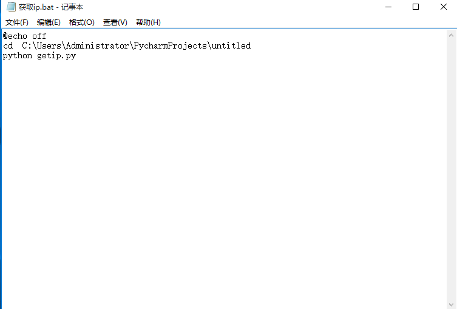
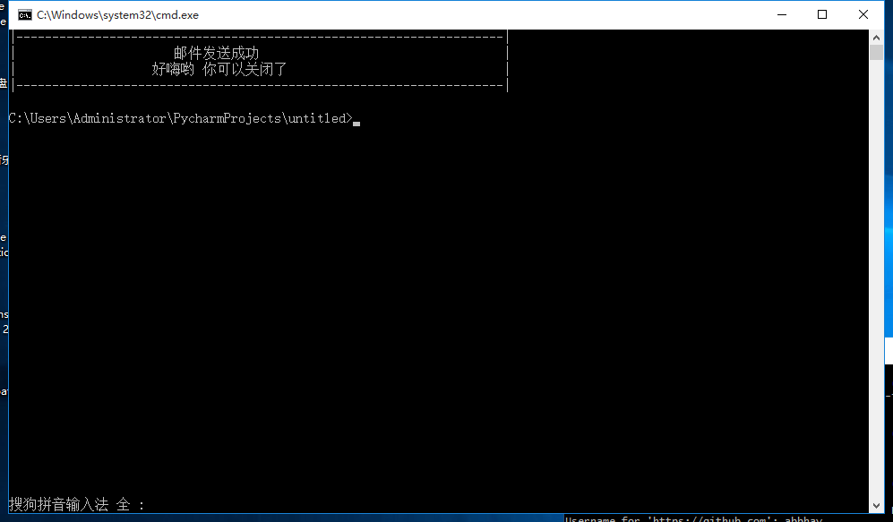
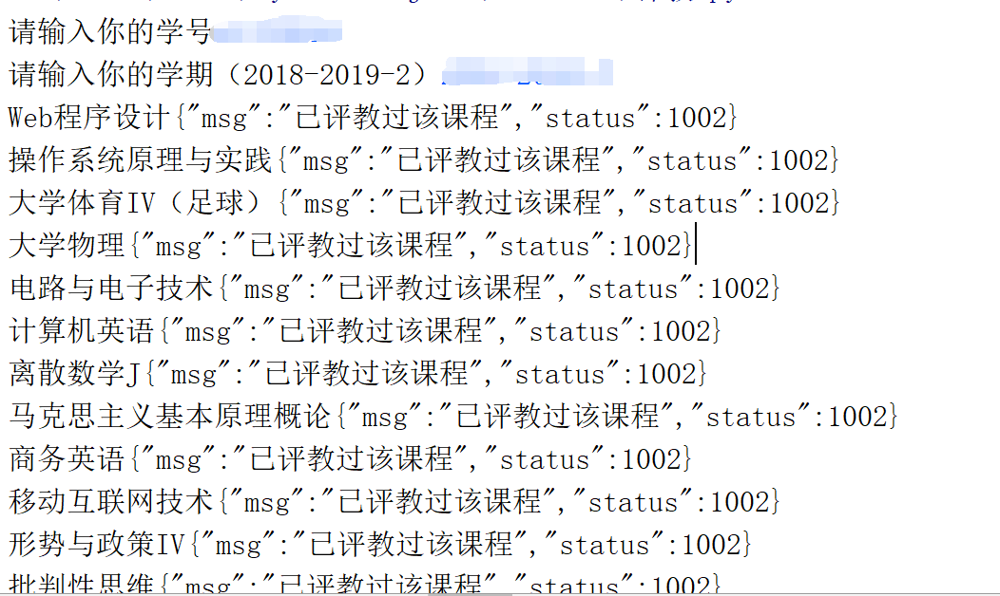

# 天府插件合集

1. [获取ip](#获取ip)

2. [tfinfo-评教](#tfinfo-评教)

3. [web-评教](#)

4. [最后请点个赞吧](#个人博客)

   

____

## 获取ip

###### 项目介绍
自动登录西南财经大学天府学院校网并且获取ip发到指定邮箱

 
 
 

感谢[robertzhang10](https://blog.csdn.net/robertzhang10/article/details/2099589?utm_source=blogxgwz3)
提供的bat命令框不关闭的方法
#### 软件架构
软件架构说明
获取data
发送数据到服务器
认证成功
发送ip

#### 安装教程

环境 python 3.6

#### 使用说明
1. 建议将以及需要输入的东西保存为字符串
2. 自己电脑获取ip只需将getip.py丢到电脑启动项（百度）
3. 开机 自动联网 获取ip 指定邮箱 走人
4. 若是提醒别人的请选择bat命令

#### 参与贡献

1. Fork 本项目
2. 新建 Feat_xxx 分支
3. 提交代码
4. 新建 Pull Request

_____

## tfinfo-评教

###### 项目介绍

自动进行tfinfo软件app评教

#### 软件架构

软件架构说明

1. tfpingjiao new一个类 保存初始化信息
2. 使用抓包精灵开始抓包
3. 定义get_detail_course 开始发包
4. 一秒完成（随机3-5打分 修改grade 即可）

#### 安装教程

环境 python 3.6

#### 使用说明

1. 输入自己的学号

2. 选择学期 字符串要对

3. 运行

   

#### 参与贡献

1. Fork 本项目
2. 新建 Feat_xxx 分支
3. 提交代码
4. 新建 Pull Request

### 

### 个人博客
[我的博客](https://abbhay.github.io) 欢迎stat

