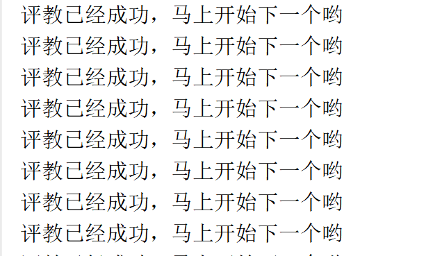
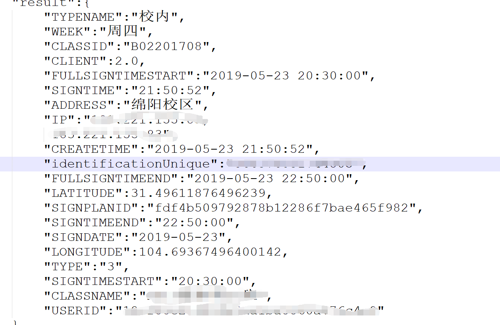
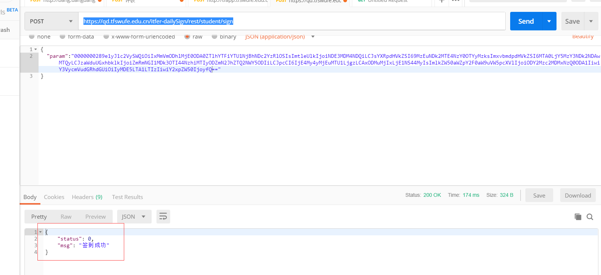
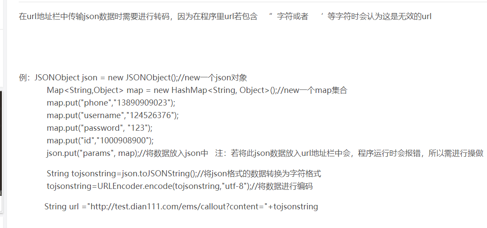
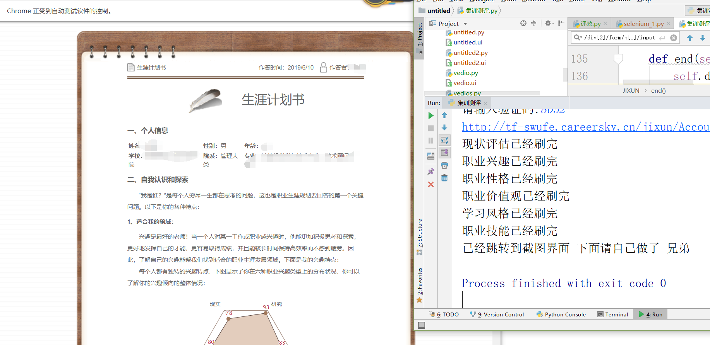
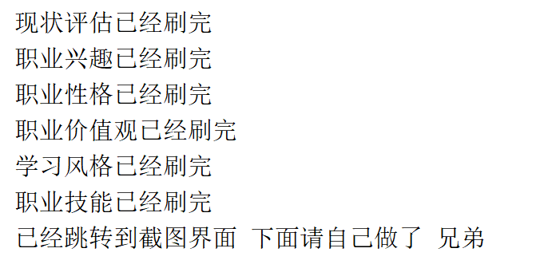

# 天府插件合集

1. [获取ip](#获取ip)

2. [TFinfo-评教](#tfinfo-评教)

3. [web-评教](#Web-评教)

4. [TFinfo-晚签到](#)

5. [吉训测评](#吉讯测评)

6. [最后请点个赞吧](#个人博客)

   

____

## 自我简介

  ❥❥❥  一个热爱python的pythoner，姓名坑坑，性别 男，爱好 女，喜欢做一些有趣的事情 写这些插件仅仅用于学习目的，若出现任何问题，和本人无关，仅供学习加油 [我的博客](https://abbhay.github.io)  (^_-)   若觉得有用 那就请支持我给我买包[辣条](#资助)吧  嘻嘻嘻
  如果有商业合作联系：1452245133
  最后请白嫖的同学点个star，送个[辣条](#资助)吧 谢谢

————

## 获取ip

###### 项目介绍
自动登录西南财经大学天府学院校网并且获取ip发到指定邮箱

 
 
 

感谢[robertzhang10](https://blog.csdn.net/robertzhang10/article/details/2099589?utm_source=blogxgwz3)
提供的bat命令框不关闭的方法
#### 软件架构
软件架构说明
获取data
发送数据到服务器
认证成功
发送ip

#### 安装教程

环境 python 3.6

#### 使用说明
1. 建议将以及需要输入的东西保存为字符串
2. 自己电脑获取ip只需将getip.py丢到电脑启动项（百度）
3. 开机 自动联网 获取ip 指定邮箱 走人
4. 若是提醒别人的请选择bat命令

#### 参与贡献

1. Fork 本项目
2. 新建 Feat_xxx 分支
3. 提交代码
4. 新建 Pull Request

_____

## Web-评教

###### 项目介绍

自动进行登陆web评教

#### 软件架构

软件架构说明

1. selenium 获取 每个url 进行 点击
2. 所有选择都是积极向上的 在按钮1 到 按钮3之间
3. 定义评教函数ogin post data 
4. 三秒完成（随机3-5打分 修改grade 即可）
5. 解决bug  selenium 点击网页后重定向 

#### 安装教程

环境 python 3.6

#### 使用说明

1. 输入自己的学号

2. 输入自己的密码

3. 输入自己的验证

   

## TFinfo-评教

###### 项目介绍

自动进行tfinfo软件app评教

#### 软件架构

软件架构说明

1. tfpingjiao new一个类 保存初始化信息
2. 使用抓包精灵开始抓包
3. 定义get_detail_course 开始发包
4. 一秒完成（随机3-5打分 修改grade 即可）

#### 安装教程

环境 python 3.6

#### 使用说明

1. 输入自己的学号

2. 选择学期 字符串要对

3. 运行

   

____

## TFinfo-晚签到

###### 项目介绍

自动进行tfinfo软件晚签到实现（未实现）

#### 参数

1. 签到原理 登陆tfinfo，点击晚签到，第一步经过设备验证，匹配成功，调到签到界面，匹配失败，不给予通过，签到界面点击签到，签到成功
2. 发包的网址 ：https://qd.tfswufe.edu.cn/itfer-dailySign/rest/student/sign
3. 请求方式 : POST
4. 发包的参数：USERID,KEYID,LATITUDE,LONGITUDE,SIGNPLANID,IP,IDENTIFCATIONUNIQUE,CURRENTDATE,CLIENT(等等)
   1. USERID：学生用户通过md5生成的id（不变）
   2. KEYID:学生学号（不变）
   3. LATITUDE:经度
   4. LONGITUDE：纬度
   5. SIGNPLANID：签到计划 是一段字符串（不变）
   6. IP（不变 学校公网ip）
   7. IDENTIFCATIONUNIQUE：唯一设备号识别 
   8. CURRENTDATE：当前签到的时间
   9. CLIENT：学生用户的第几个设备号（一个学生只能绑定两个设备）
   10.  暂时抓包就是这几个 
5. 加密方式：url传输json字符串的过程中采用的是base64加密
6. 可通过技术解决以下下问题
   1. 设备验证
      1.  手机root ，将自己的设备号改成自己绑定了的设备号（难度低 不建议 没啥用）
   2. 晚签到
      1. 将tfinfo反编译找到关于签到的模块查看 加密的顺序 难度高
7. 获得参数方式1（GET）https://qd.tfswufe.edu.cn/itfer-dailySign/rest/student/sign/itfer-dailySign/rest/student/getTodaySignPlan/12ef88e214804e9aa1ba5560a476c4e9/B02201708
8. 
9. 晚签到（POST）https://qd.tfswufe.edu.cn/itfer-dailySign/rest/student/sign
10. 

++++

#### 用java写的后台

____

#### 加密数据

[加密数据](https://github.com/abbhay/tfswufe_apps/blob/master/util/tfinfo%E6%99%9A%E7%AD%BE%E5%88%B0%E5%8A%A0%E5%AF%86%E6%95%B0%E6%8D%AE.txt)

#### 总结

要先解决晚签到 首先要知道加密方式，加密方式猜出来后知道是base64加密的，但是采用的是非对称加密，拥有公钥和私钥，也就是为什么前面12个字符基本上都是一样的，然后加密不是加密的字符串，而是加密了json字符串（有引号 括号这些 ）还采用了 防止出现加减 用了等号去代替，一句话来说，不是专业的 破解起来太难了。

___

## 吉讯测评

###### 项目介绍

随机去做吉讯测评相关的习题

***请注意 此项目是自己随机选 若使用该程序出现任何问题  概不负责***

#### 软件架构

软件架构说明

1. 通过selenium+xapth
2. 通过登录 提交表单
3. 6秒刷完所有信息

### 学习心得

1.  random 中打乱顺序  shuffle 只对原来的列表进行变化

2. selenium 中 截图的方式是 save_screenshot

   

### 潜在BUG

1. 建议不要自己填写后再去用此代码 因为 集训测评有在线保存的功能 

#### 安装教程

环境 python 3.6

#### 使用说明

1. 输入自己的学号

2. 选择学期 字符串要对

3. 运行

   

### 

____

## 资助

支付宝打赏:

微信打赏：

_____

### 个人博客
[我的博客](https://abbhay.github.io) 欢迎stat

